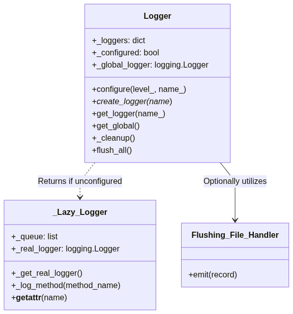

# Runtime persistante Logger

## Overview

**TLDR:** Init the logger once (`Singleton`), even across different modules.

The provided logging suite offers a robust, crash-resilient mechanism for capturing software execution states. The architecture is designed to address the synchronization of log events across multiple modules avoiding repetitive formal configuration. Implemention deferred execution queue, the system ensures that early-stage initialization logs are preserved and subsequently written to disk once the primary logging configuration is exited (halted or crashed).
**Diclaimer**: This logger does not substitute design pattern where multiple loggers are required.

## Architectural Design

The framework employs a modified `Singleton` pattern to manage a non-global logging state. The architecture comprises three primary components: the central `Logger` class, a proxy `_Lazy_Logger` class, and a customized `Flushing_File_Handler`.

mermaid diagram



## Design Logic and Theoretical Framework

### Deferred Execution and State Management

A significant challenge in distributed or multi-module software architectures is the instantiation of logging mechanisms before the central configuration is applied. Standard Python logging modules often discard or improperly route these early messages. The implementation resolves this through the `_Lazy_Logger` class. This proxy object captures logging method calls and arguments, storing them in memory. Upon the invocation of `Logger.configure()`, the queue is flushed to the permanent disk location. This behaviour ensures zero data loss during application bootstrapping.

### Application of SOLID Principles

The design aligns with a couple SOLID principles, which was the inspiration for writing this project after discussion with some of my students.

**Single Responsibility Principle**: The `_Lazy_Logger` is strictly responsible for message queuing, while the Logger class manages file handles and configuration state.

**Open/Closed Principle**: The system can be extended with custom handlers, such as the `Flushing_File_Handler`, without modifying the core Logger class logic.

**Liskov Substitution Principle**: The `_Lazy_Logger` dynamically mimics the interface of a standard `logging.Logger` via the __getattr__ method, allowing it to serve as a transparent substitute for the underlying logging object.

### Crash Resiliency

`Singleton-Logger` prioritizes message preservation during runtime error. By registering the `_cleanup` method with the `atexit` module, the suite ensures that all file buffers are flushed to the disk/file upon normal or abnormal termination. Additionally, the `Flushing_File_Handler` forces a disk write operation after every individual log emission, minimizing the risk of data loss from operating system buffering delays.

### System Advantages

**Initialization Safety**: Modules can safely request and utilize logger instances at import time without waiting for the primary application entry point to execute configuration parameters.

**Data Integrity**: The explicit use of the atexit registry and immediate file creation ensures that diagnostic information is captured even when unhandled exceptions occur.

**Centralized Configuration**: All module-level loggers inherit the formatting and output destinations defined during the single configure method call. This eliminates fragmented log files.

### System Limitations

**Performance Overhead**: The stringent flushing protocols introduce significant disk input/output latency, particularly if `Flushing_File_Handler` is widely applied. Writing to disk after every event reduces the overall throughput of high-frequency execution paths.

**Memory Constraints**: If the application fails to call `Logger.configure()` in a timely manner, the `_Lazy_Logger` queue will expand indefinitely. In long-running applications that fail to initialize properly, this behaviour may lead to memory exhaustion.

**Singleton State Complexity**: The reliance on class-level attributes introduces global state. This design choice complicates unit testing, as test environments must explicitly reset the `_configured` flag and internal dictionaries between test suites to prevent state leakage.

## Implementation Guidelines
The following code illustrates the intended usage paradigm for the suite.

in `main.py`, the first logger is initialized.

```python
import os
import logging
import singleton_logger as Logger

from .do_something import do_something
from .do_something_else import do_something_else

def main():

  Logger.configure(
    level_ = logging.DEBUG, # integer values also available
    name_ = "singleton_logger"
  )
  
  log = Logger.get_logger()
  log.info( "Application initialized successfully" )
  
  try:
    do_something()
  
  except Exception as e:

    log.error( f"Critical failure: {e}" )
    Logger.flush_all()
    raise

  do_something_else()
```

in module `do_something.py`, logger gets the singleton if a new logger is not instantiated.

```python 
import Logger

def do_something():

  log = Logger.get_logger("singleton_logger")
  log.debug("Processing routine started")
```

in module `do_something_else.py`

```python 
import Logger

def do_something_else():

  log = Logger.get_logger("singleton_logger")
  log.warning("Processing routine started")

```

## Future implementations 

1. Logger streams log messages via api, email, ...
1. Improvements module ux, specially for `Logger.configuration`


## References

Gamma, E., Helm, R., Johnson, R., & Vlissides, J. (1994). Design patterns: elements of reusable object-oriented software. Addison-Wesley.

Yuan, D., Zheng, J., Park, S., Zhou, Y., & Balaraman, S. (2012). Improving software diagnosability via log enhancement. ACM Transactions on Computer Systems (TOCS), 30(1), 1-28.

Fu, Q., Lou, J. G., Wang, Y., & Li, J. (2014). Execution anomaly detection in distributed systems through unstructured log analysis. In 2009 Ninth IEEE International Conference on Data Mining (pp. 149-158). IEEE.
